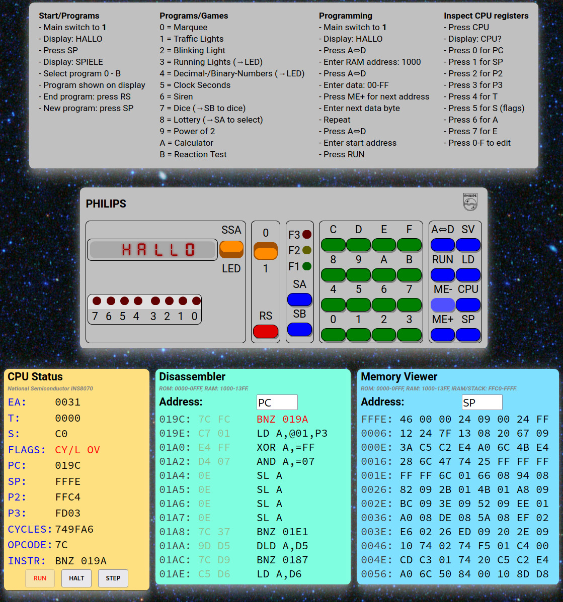

# Virtual Philips MasterLab MC6400 and INS8070 CPU Emulator
This project emulates the "Philips MasterLab MC6400", a computer learning kit from the early 1980s.

# Introduction
The Philips 6400 Microcomputer Master Lab, also named "MC6400", was introduced in 1983.

It is computer training and teaching device, integrated in the Philips electronics lab kit series.
The system was fully programmable through its alphanumeric keyboard.
It had a two inputs and three outputs to connect with electronics experiments based on the kit series.
The kit series was popular in Europe, mainly in the Netherlands and Germany.

## Background
The MC6400 was developed in Germany by Erhard Meyer, a teacher normally working at Hamburg's teacher training institute.
As to be expected from someone with a professional school teaching background,
it came with a very thorough training manual,
teaching the topic of computers, programming and electronics from the very bottom up.
Unlike the rest of the series, as far as known, the manual was not translated, and this kit was only sold in German.
 
 
The kit was produced and distributed by the [Georg Adam Mangold GmbH (GAMA)](https://en.wikipedia.org/wiki/Gama_Toys),
a German toy manufacturer, which had taken over the electronics kit business from Philips in the early 1980s.
Initially still selling under the "Philips" brand, as of 1985 GAMA switched the entire kit series to use their
own "Schuco" brand instead.
The MC6400 was not a great sales success. By the mid 1980s other computers, especially the C64,
were already dominating, leaving very little market share for dedicated computer training kits.
 
 
The device was based on the National Semiconductor CPU "INS8070".
It features an 8bit hardware interface, internal 16bit registers and runs at 4MHz.
The microcontroller had 64byte of internal RAM, an external 8bit data / 16bit address bus,
two input I/O ports and three output ports.
The MC6400 board came with 2KB of additional external RAM and 4KB of external ROM.
The INS8070 instruction set is similar to many other CPUs of the time - but does have a number of
unusual quirks (all jump target addresses off by 1, status register without a zero flag,
no dedicated instructions to manipulate flags and awkwardly complex
"*search in memory*" instruction).

# The Virtual MC6400
This project provides virtual MC6400, an (almost) fully functional hardware emulator.
It emulates the CPU and the default MC6400 board hardware with its displays and buttons.
 
 
The CPU status display, disassembler and memory viewer below were, of course, not available with the
original device.

Follow [THIS LINK](https://thorstenbr.github.io/MasterLab-MC6400) to try it out!
Remember to hit the ON/OFF (0/1) button to start...

# Links
* [The Virtual Philips MasterLab MC6400](https://thorstenbr.github.io/MasterLab-MC6400)
* [My GitHUB project for the Virtual MC6400](https://github.com/ThorstenBr/MasterLab-MC6400)
* [INS8070 Instruction Set Summary](http://norbert.old.no/papers/datasheet/INS8070InstructionSetSummary.pdf)
* [YouTube Video demonstrating the real hardware](https://www.youtube.com/watch?v=D79aGjK4ByY)
* [Photos of the kit](http://retro.hansotten.nl/electronic-kits-philips-and-more/philips-electronic-kits/microcomputerlab-ce6400/)

In German:

* [Extensive Documentation](http://norbert.old.no/extra/extra3.html) (German)
* [Original Manual](http://ee.old.no/library/6400-MC-de.pdf) (very comprehensive but German)
* [Magazine Article](https://www.classic-computing.de/wp-content/uploads/2024/10/load10web.pdf) (*Classic Computing "LOAD"* magazine, see page 72)
 

# License
Released under the [CC-BY-SA-4.0 license](LICENSE).

Copyright 2024 Thorsten Brehm.
